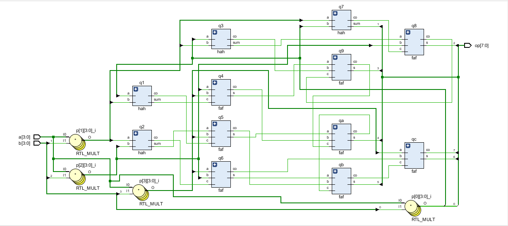
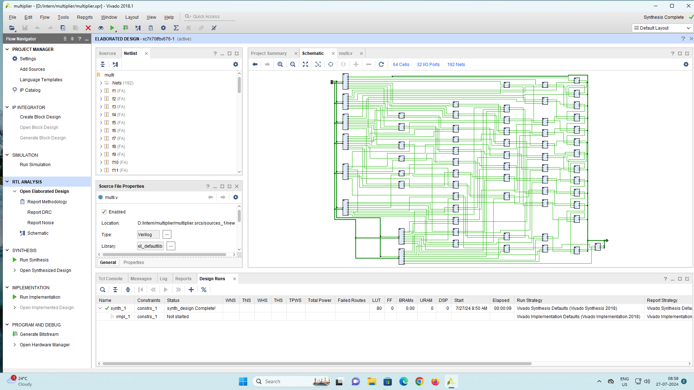
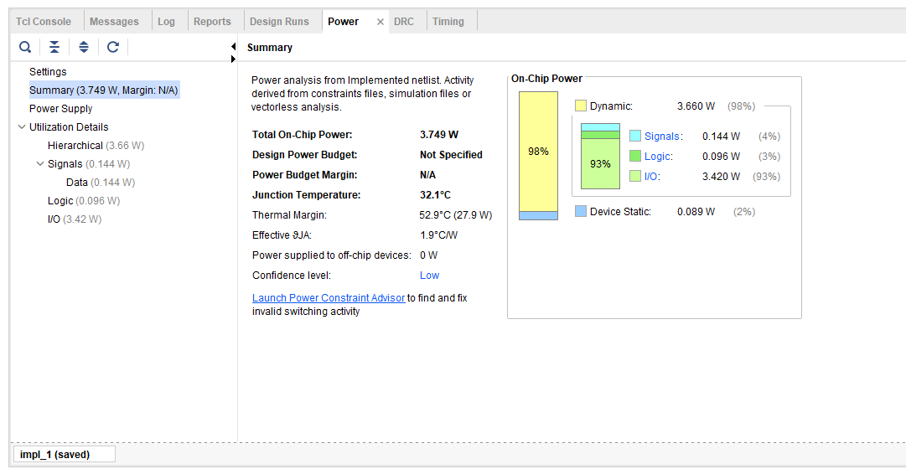
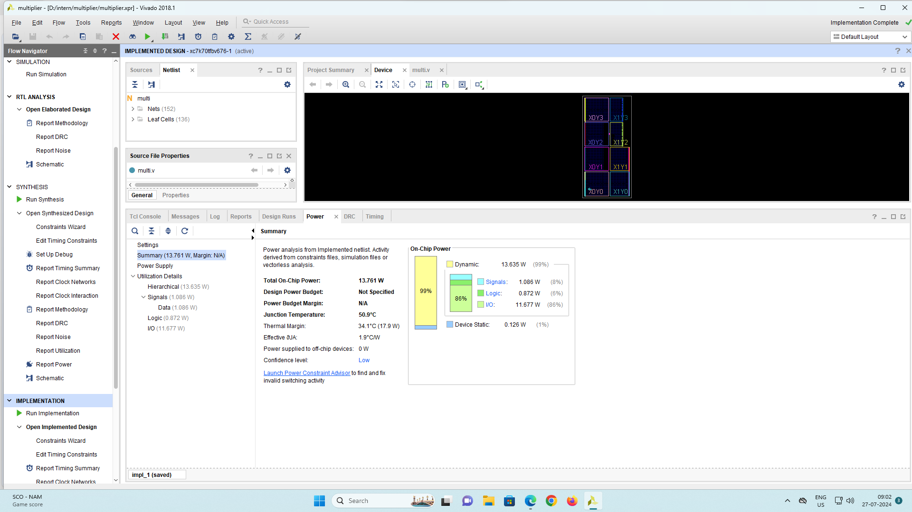

# Dadda 8-bit High-Speed Low-Power Multiplier 
This project implements an 8-bit Dadda multiplier architecture optimized for high-speed and low-power operation. The Dadda algorithm is an efficient parallel multiplier design that minimizes the number of partial product reduction stages, resulting in faster computation with reduced hardware complexity. 
The design focuses on low power consumption and high-speed operation, making it suitable for System-on-Chip (SoC) and AI acceleration applications.
The design was synthesized, implemented, and analyzed using Xilinx Vivado 2018.1.
#  Design Flow
-HDL Coding – Verilog description of the multiplier.

-RTL Analysis – Verification of schematic and logic structure.

-Implementation – Placement and routing of design.

-Power & Utilization Analysis – power usage estimation.

-Technology Node Comparison – Power/area trade-offs for 180nm, 90nm, and 45nm.

# 4-bit Multiplier Schematic

# 8-bit Multiplier Schematic

# 4-bit Multiplier Power Analysis

Optimized Power Case (4-bit):

-Total On-Chip Power: 3.749 W → ~73% lower than the 8-bit version.

-Dynamic Power: 3.660 W (98%) → Still the major power consumer, but much less than the 8-bit design because fewer bits toggle per cycle.

-Static Power: 0.089 W (2%) → Leakage is again minimal.

-Logic Power: 0.096 W (3%) → Much smaller because of reduced datapath width and possibly optimized logic usage.

-I/O Power: 3.420 W (93%) → Still the main component, but 3.4 W vs 11.6 W is a huge drop, showing the effect of halving the bus width.

-Junction Temp: 32.1°C → Much cooler due to less switching.

Observation: By reducing from 8-bit to 4-bit, both internal logic switching and I/O capacitance load per cycle dropped, lowering power drastically.

The 4-bit optimized implementation achieves a total on-chip power of just 3.749 W, representing a substantial reduction in energy usage compared to the 8-bit design. Dynamic power is still the dominant factor at 98% (3.660 W), but the overall magnitude is much smaller due to reduced data width, fewer active transitions, and lighter switching loads. Static power is 0.089 W (2%), showing a similar low-leakage characteristic.
Here, I/O power still forms the largest portion at 93% (3.420 W), but because the total scale is lower, it does not impose as much thermal or energy strain. Logic power is drastically reduced to 0.096 W (3%), highlighting the benefit of minimized logic complexity in the smaller architecture. The junction temperature is 32.1°C, a significant improvement, allowing operation without aggressive cooling measures.
This lower-power profile makes the 4-bit design ideal for embedded, portable, and battery-powered applications, where efficiency and minimal heat generation are critical.

# 8-bit Multiplier Power Analysis

Higher Power Case (8-bit):

-Total On-Chip Power: 13.761 W → This is quite high for an SoC-level block; the majority is dynamic power.

-Dynamic Power: 13.635 W (99%) → Indicates most of the power is consumed during switching activities (clock toggling, data transitions, I/O activity).

-Static Power: 0.126 W (1%) → Leakage power is very small compared to dynamic, meaning the design is more active-driven than leakage-driven.

-Logic Power: 0.872 W (6%) → Logic gates contribute only a small fraction; the real culprit is elsewhere.

-I/O Power: 11.677 W (86%) → This is the biggest contributor — heavy data transfers, wide buses (8-bit), or high I/O toggle rates are driving the power.

-Junction Temp: 50.9°C → Higher switching activity = higher temperature.

Observation: The huge I/O power means either high output loading, high toggle rates, or large capacitances. The wider 8-bit interface increases switching per cycle compared to 4-bit.

The 8-bit implementation demonstrates significantly higher power consumption, with a total on-chip power of 13.761 W. The dynamic power component dominates at 99% (13.635 W), indicating that most of the energy is consumed during switching and signal transitions due to the larger data width and higher switching activity. Static power is relatively minimal at 0.126 W (1%), suggesting that leakage currents are not the primary source of power loss.
Breaking down the dynamic power further, I/O power accounts for a massive 86% (11.677 W), revealing that external signal driving and interfacing are the main contributors to the high power usage. Logic power is 6% (0.872 W), meaning computation itself consumes a smaller fraction compared to data transfer. The junction temperature reaches 50.9°C, showing that thermal management becomes more critical at this scale.
This high power profile makes the 8-bit design less suitable for low-power applications, but it may still be justified in performance-driven systems where speed and throughput outweigh energy efficiency.

## Conclusion
The optimized (4-bit) implementation achieves a **massive reduction in power consumption** and operating temperature compared to the 8-bit design.  
Key improvements include:
- **~72.8% lower total power**
- **Significant drop in I/O and logic power**
- **Lower junction temperature**, improving reliability and thermal stability  

This makes the design far more efficient and well-suited for **low-power, thermally-constrained applications**.

## Technology Node Power & Area Comparison (Cadence RTL Analysis)

The following results are obtained from **Cadence Genus Power Analysis**, comparing three technology nodes (**180nm, 90nm, and 45nm**) under different operating corners (Slow, Typical, Fast).

| Node      | Mode    | Leakage Power (nW) | Internal Power (nW) | Net Power (nW) | Switching Power (nW) | Area (µm²) | Gate Count |
| --------- | ------- | ------------- | -------------- | --------- | --------------- | ---------- | ---------- |
| **180nm** | Slow    | 45.377        | 26294.409      | 7042.284  | 33336.693       | 918.86     | 28         |
|           | Typical | 6.285         | 33620.146      | 8849.716  | 42469.863       | 918.086    | 28         |
|           | Fast    | 32.693        | 4474.190       | 10969.65  | 55043.82        | 918.086    | 28         |
| **90nm**  | Slow    | 1438.452      | 4174.337       | 1897.949  | 6072.286        | 278.539    | 28         |
|           | Typical | 1181.336      | 3998.29        | 2395.141  | 6393.43         | 278.539    | 28         |
|           | Fast    | 2413.914      | 6037.796       | 2981.385  | 9019.181        | 278.539    | 28         |
| **45nm**  | Slow    | 6.626         | 3303.735       | 1488.358  | 4792.094        | 0          | 32         |
|           | Typical | 8.666         | 4054.098       | 1937.651  | 5991.75         | 0          | 32         |
|           | Fast    | 20.855        | 5141.857       | 2412.227  | 7554.085        | 0          | 32         |

### Conclusion
- **Data Source:** Cadence RTL Compiler/Genus analysis with technology libraries for 180nm, 90nm, and 45nm nodes.
- **Technology scaling** significantly reduces **area** and **leakage power** from 180nm → 45nm.
- **Dynamic and switching power** are lowest in 45nm, making it more suitable for **low-power applications**.
- **Fast corner** increases power consumption due to higher operating speeds.
- Gate count remains constant across nodes for the same logic function, but physical **area shrinks drastically** with smaller nodes.

##  Tutorial Reference  
This video guided the RTL synthesis steps in Cadence using the Genus tool:

- **PART 1: RTL SYNTHESIS USING CADENCE GENUS TOOL** — walks through RTL synthesis from Verilog to netlist using Cadence Genus, helped with the design flow and synthesis aspects of this project.  
  [Watch on YouTube](https://youtu.be/73sXAcse3NA?feature=shared)
